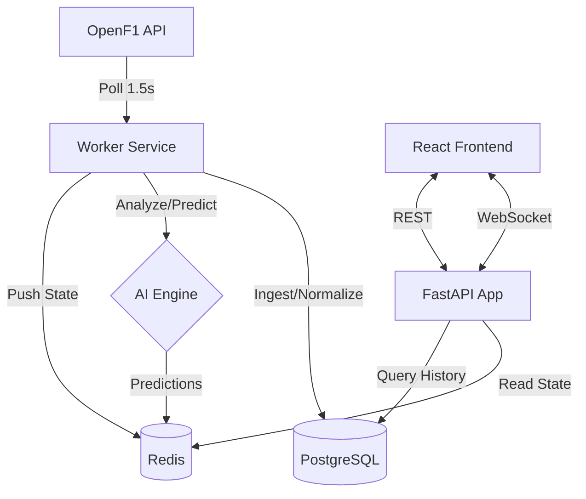

# F1 Analytics Platform

A high-performance, real-time Formula 1 analytics dashboard featuring live data ingestion from OpenF1 and AI-driven race predictions.


## 🏎️ Overview

This platform provides a comprehensive view of ongoing Formula 1 sessions. It integrates live timing, car positions, and team radio with an AI engine that predicts pit stops and overtakes in real-time.

### Key Features

- **Live Leaderboard:** Real-time updates of driver positions, gaps, and lap times.
- **AI Predictions:** Probabilistic modeling for pit stop windows and overtake opportunities.
- **Race Timeline:** Categorized event stream (pit stops, overtakes, safety cars, etc.).
- **Dynamic Track Map:** (Planned/In Progress) Visualization of car positions on track.
- **Strategy Insights:** Analysis of tire compounds and stint lengths.
- **Replay & Simulation:** Local simulator for testing and development without a live session.

---

## 🏗️ Architecture

The system is built with a distributed architecture to ensure low latency and high availability.



### Backend
- **API:** FastAPI (Asynchronous)
- **Worker:** Python-based ingestion engine
- **Database:** PostgreSQL (Historical data)
- **Cache/Bus:** Redis (Live state & Pub/Sub)
- **Data Source:** [OpenF1 API](https://openf1.org)

### Frontend
- **Framework:** React 18 with TypeScript
- **State Management:** Zustand
- **Build Tool:** Vite
- **Styling:** Tailwind CSS
- **Charts:** Recharts

---

## 🚀 Getting Started

### Prerequisites

- [Docker](https://www.docker.com/) & Docker Compose
- Node.js (v18+) & npm (if running frontend locally)
- Python 3.11+ (if running backend locally)

### Quick Start (Docker)

The easiest way to get the platform running is using Docker Compose.

1. **Clone the repository:**
   ```bash
   git clone <repository-url>
   cd F1
   ```

2. **Configure Environment:**
   ```bash
   cp backend/.env.example backend/.env
   # Frontend uses defaults, but can be configured in frontend/.env
   ```

3. **Launch the stack:**
   ```bash
   docker compose -f backend/docker-compose.yml up --build
   ```

The application will be available at:
- **Frontend:** `http://localhost:5173`
- **Backend API:** `http://localhost:8000`
- **Health Check:** `http://localhost:8000/health`

---

## 📂 Project Structure

```text
.
├── backend/            # FastAPI, Worker, AI Models
│   ├── app/            # Core application logic
│   ├── worker/         # Data ingestion worker
│   └── ...
├── frontend/           # React Dashboard
│   ├── src/            # Components, hooks, stores
│   └── ...
└── README.md           # This file
```

---

## 🧪 Development

### Running Locally (Without Docker)

**Backend:**
1. Start PostgreSQL and Redis (you can use docker for just these: `docker compose up postgres redis -d`).
2. Install dependencies: `cd backend && pip install -r requirements.txt`.
3. Run the API: `uvicorn app.main:app --reload`.
4. Run the Worker: `python -m worker.main`.

**Frontend:**
1. Install dependencies: `cd frontend && npm install`.
2. Start dev server: `npm run dev`.

---

## 🤖 AI Modules

- **Pit Stop Predictor:** Uses tire age, compound, and lap time degradation to predict upcoming pit visits.
- **Overtake Predictor:** Analyzes gaps and pace deltas to estimate the probability of a position change.
- **Race Summary:** (Experimental) Generates narrative descriptions of race events.

---

## 📜 License

[MIT License](LICENSE)
